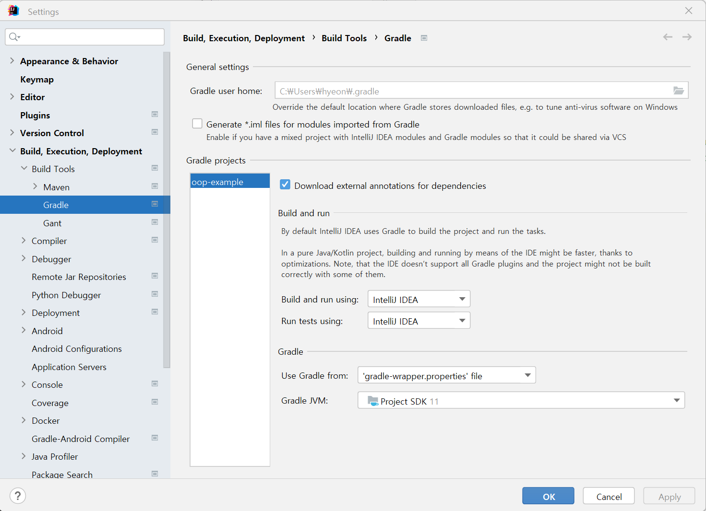
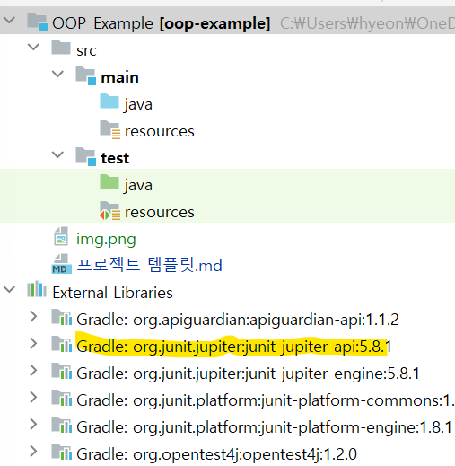

# 프로젝트 이름

   
  
   

목차

## 프로젝트 소개

프로젝트 개요/동기

 

## 기술 스택

 

## 구현 기능

### 기능 1

### 기능 2

### 기능 3

### 기능 4

 

## 배운 점
- ### 환경 세팅
1. gradle은 intelliJ 스타일로 변경
2. junit은 프로젝트 생성만 해도 자동으로 gradle에 추가 돼 있음 
 

## 라이센스

MIT &copy; [NoHack](mailto:lbjp114@gmail.com)
